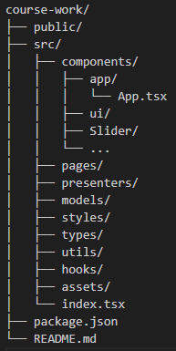

# Project Novoakopovsk

Добро пожаловать на официальный сайт Minecraft-сервера "Project Novoakopovsk".

# Описание

Этот веб-сайт представляет собой интерфейс для Minecraft-сервера "Project Novoakopovsk". Он предоставляет игрокам информацию о сервере, его возможностях, правилах, а также позволяет ознакомиться с привилегиями и новостями.

Технологии, используемые в проекте:

1. Frontend: React 18;
2. Язык программирования: TypeScript;
3. Система сборки: Create React App;
4. Менеджер пакетов: npm;
5. Маршрутизация: React Router;
6. Стили: CSS;
7. HTTP-клиент: axios (опционально, для API);
8. Архитектура проекта: MVP (Model-View-Presenter);
9. Структура компонентов: UI-компоненты и компоненты, получающие данные.

# Архитектура

Проект реализован по архитектурному паттерну MVP (Model-View-Presenter), который разделяет логику представления и бизнес-логику, улучшая тестируемость и поддерживаемость кода. Компоненты разделены на UI-компоненты (только отображение) и компоненты, получающие данные.

# Структура проекта

# Установка и запуск

1. Убедитесь, что у вас установлены Node.js(v16+) и npm(v8+);
2. Склонируйте репозиторий
   git clone https://github.com/xXxEvgenyxXx/course-project;
3. Перейдите в директорию проекта:
   cd course-work
4. Установите зависимости:
   npm install
5. Запустите в режиме разработки:
   npm start

# Сборка

Для создания продакшн-сборки, выполните:
npm run build

Собранные файлы будут находиться в папке ./build/

# Страницы:

1. Главная: Приветствие, статус сервера, ссылка на лаунчер, слайдер новостей;
2. Сервера: Описание каждого сервера, правила, история проекта, FAQ;
3. Магазин привилегий: Слайдер привилегий с подробной информацией.

Автор: Евгений Симонов
